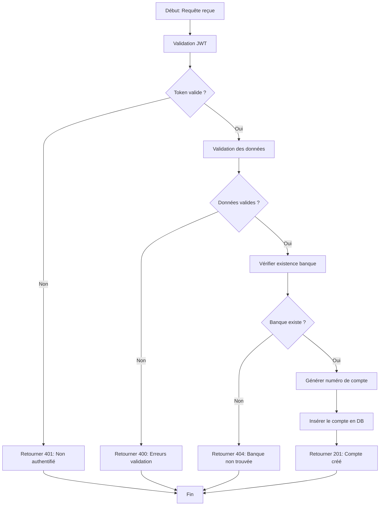

```mermaid
graph TD
    A[Début: Requête reçue] --> B[Validation JWT]
    B --> C{Token valide ?}
    C -- Non --> D[Retourner 401: Non authentifié]
    C -- Oui --> E[Validation des données]
    E --> F{Données valides ?}
    F -- Non --> G[Retourner 400: Erreurs validation]
    F -- Oui --> H[Vérifier existence banque]
    H --> I{Banque existe ?}
    I -- Non --> J[Retourner 404: Banque non trouvée]
    I -- Oui --> K[Générer numéro de compte]
    K --> L[Insérer le compte en DB]
    L --> M[Retourner 201: Compte créé]
    D --> N[Fin]
    G --> N
    J --> N
    M --> N
```