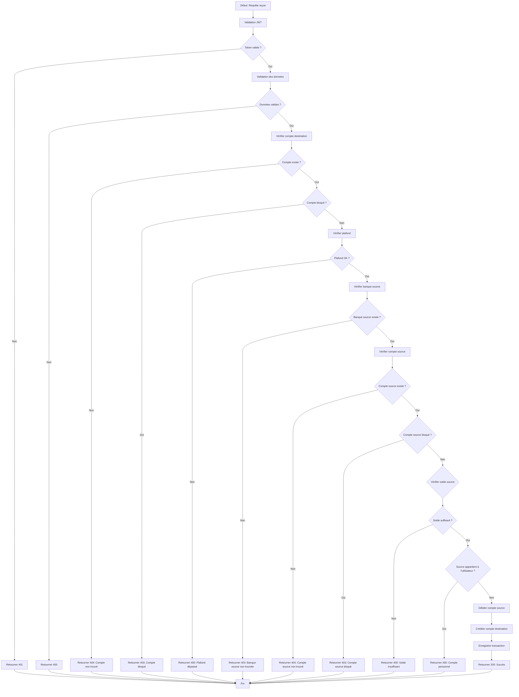

```mermaid
graph TD
    A[Début: Requête reçue] --> B[Validation JWT]
    B --> C{Token valide ?}
    C -- Non --> D[Retourner 401]
    C -- Oui --> E[Validation des données]
    E --> F{Données valides ?}
    F -- Non --> G[Retourner 400]
    F -- Oui --> H[Vérifier compte destination]
    H --> I{Compte existe ?}
    I -- Non --> J[Retourner 404: Compte non trouvé]
    I -- Oui --> K{Compte bloqué ?}
    K -- Oui --> L[Retourner 403: Compte bloqué]
    K -- Non --> M[Vérifier plafond]
    M --> N{Plafond OK ?}
    N -- Non --> O[Retourner 400: Plafond dépassé]
    N -- Oui --> P[Vérifier banque source]
    P --> Q{Banque source existe ?}
    Q -- Non --> R[Retourner 404: Banque source non trouvée]
    Q -- Oui --> S[Vérifier compte source]
    S --> T{Compte source existe ?}
    T -- Non --> U[Retourner 404: Compte source non trouvé]
    T -- Oui --> V{Compte source bloqué ?}
    V -- Oui --> W[Retourner 403: Compte source bloqué]
    V -- Non --> X{Vérifier solde source}
    X --> Y{Solde suffisant ?}
    Y -- Non --> Z[Retourner 400: Solde insuffisant]
    Y -- Oui --> AA{Source appartient à l'utilisateur ?}
    AA -- Oui --> AB[Retourner 400: Compte personnel]
    AA -- Non --> AC[Débiter compte source]
    AC --> AD[Créditer compte destination]
    AD --> AE[Enregistrer transaction]
    AE --> AF[Retourner 200: Succès]
    
    D --> AG[Fin]
    G --> AG
    J --> AG
    L --> AG
    O --> AG
    R --> AG
    U --> AG
    W --> AG
    Z --> AG
    AB --> AG
    AF --> AG
```