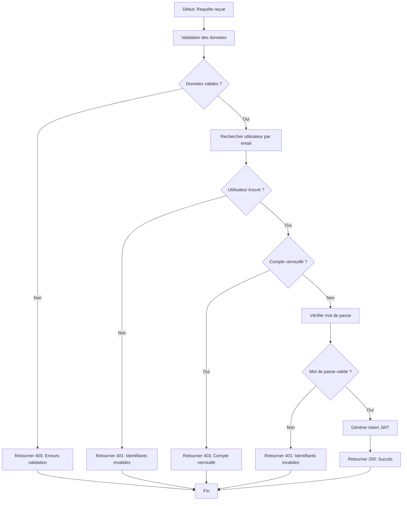

```mermaid
graph TD
    A[Début: Requête reçue] --> B[Validation des données]
    B --> C{Données valides ?}
    C -- Non --> D[Retourner 400: Erreurs validation]
    C -- Oui --> E[Rechercher utilisateur par email]
    E --> F{Utilisateur trouvé ?}
    F -- Non --> G[Retourner 401: Identifiants invalides]
    F -- Oui --> H{Compte verrouillé ?}
    H -- Oui --> I[Retourner 403: Compte verrouillé]
    H -- Non --> J[Vérifier mot de passe]
    J --> K{Mot de passe valide ?}
    K -- Non --> L[Retourner 401: Identifiants invalides]
    K -- Oui --> M[Générer token JWT]
    M --> N[Retourner 200: Succès]
    D --> O[Fin]
    G --> O
    I --> O
    L --> O
    N --> O
```