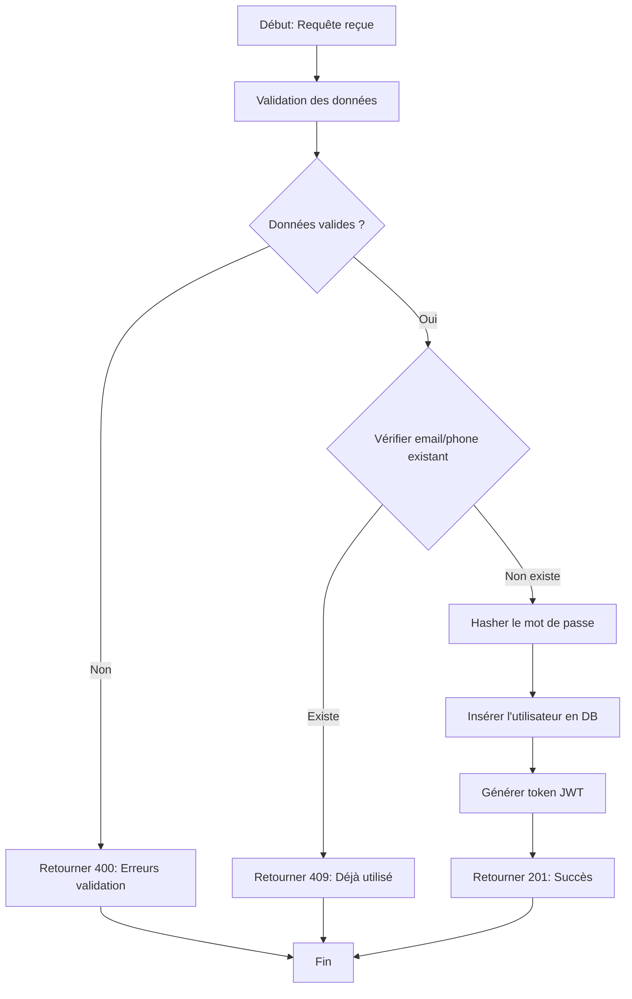

```mermaid
graph TD
    A[Début: Requête reçue] --> B[Validation des données]
    B --> C{Données valides ?}
    C -- Non --> D[Retourner 400: Erreurs validation]
    C -- Oui --> E{Vérifier email/phone existant}
    E -- Existe --> F[Retourner 409: Déjà utilisé]
    E -- Non existe --> G[Hasher le mot de passe]
    G --> H[Insérer l'utilisateur en DB]
    H --> I[Générer token JWT]
    I --> J[Retourner 201: Succès]
    D --> K[Fin]
    F --> K
    J --> K
```