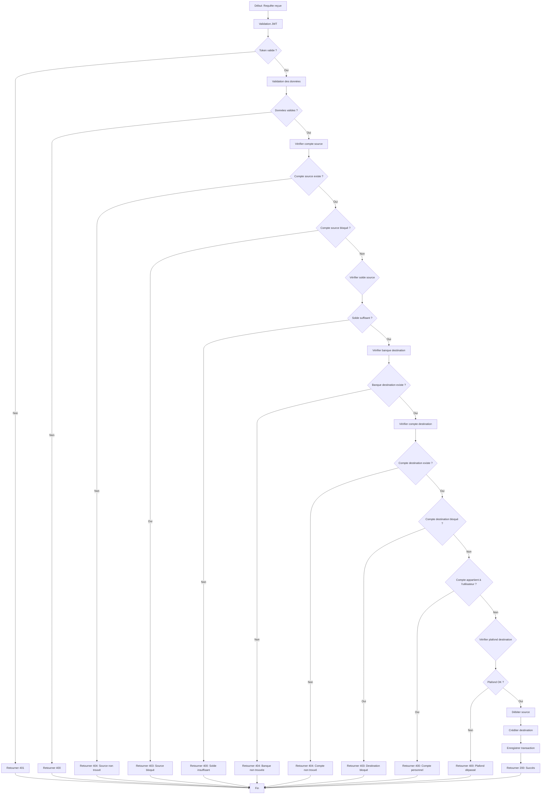

```mermaid
graph TD
    A[Début: Requête reçue] --> B[Validation JWT]
    B --> C{Token valide ?}
    C -- Non --> D[Retourner 401]
    C -- Oui --> E[Validation des données]
    E --> F{Données valides ?}
    F -- Non --> G[Retourner 400]
    F -- Oui --> H[Vérifier compte source]
    H --> I{Compte source existe ?}
    I -- Non --> J[Retourner 404: Source non trouvé]
    I -- Oui --> K{Compte source bloqué ?}
    K -- Oui --> L[Retourner 403: Source bloqué]
    K -- Non --> M{Vérifier solde source}
    M --> N{Solde suffisant ?}
    N -- Non --> O[Retourner 400: Solde insuffisant]
    N -- Oui --> P[Vérifier banque destination]
    P --> Q{Banque destination existe ?}
    Q -- Non --> R[Retourner 404: Banque non trouvée]
    Q -- Oui --> S[Vérifier compte destination]
    S --> T{Compte destination existe ?}
    T -- Non --> U[Retourner 404: Compte non trouvé]
    T -- Oui --> V{Compte destination bloqué ?}
    V -- Oui --> W[Retourner 403: Destination bloqué]
    V -- Non --> X{Compte appartient à l'utilisateur ?}
    X -- Oui --> Y[Retourner 400: Compte personnel]
    X -- Non --> Z{Vérifier plafond destination}
    Z --> AA{Plafond OK ?}
    AA -- Non --> AB[Retourner 400: Plafond dépassé]
    AA -- Oui --> AC[Débiter source]
    AC --> AD[Créditer destination]
    AD --> AE[Enregistrer transaction]
    AE --> AF[Retourner 200: Succès]
    D --> AG[Fin]
    G --> AG
    J --> AG
    L --> AG
    O --> AG
    R --> AG
    U --> AG
    W --> AG
    Y --> AG
    AB --> AG
    AF --> AG
```